# 学术主页管理系统 - 前台展示

> **最后更新**: 2026-02-08
> **项目类型**: Vue 3 多页面应用 (MPA)
> **部署目标**: 静态网站托管

## 变更记录

### 2026-02-08
- 初始化项目架构文档
- 完成全仓清点与模块识别
- 生成根级与模块级 CLAUDE.md 文档体系

---

## 项目愿景

夏铭副教授学术个人网站的前台展示系统，采用多页面应用（MPA）架构，为访问者提供学术团队信息、科研成果、新闻动态等内容的展示。项目强调学术风格的视觉设计、SEO 友好的静态链接、以及中英文双语支持。

**核心设计理念**：
- **学术风格**：采用学校官网风格，简洁专业
- **静态优先**：多页面应用架构，每个页面独立入口，便于 SEO 和直接访问
- **数据驱动**：所有内容通过后端 API 动态获取，支持后台管理
- **双语支持**：基于 Vue I18n + 腾讯翻译 API 的中英文切换

---

## 架构总览

### 技术栈

| 类别 | 技术 | 版本 | 用途 |
|------|------|------|------|
| **框架** | Vue 3 | 3.4.0 | 前端框架 (Composition API) |
| **构建工具** | Vite | 5.0.0 | 开发服务器与构建工具 |
| **UI 库** | Element Plus | 2.5.0 | 组件库 |
| **国际化** | Vue I18n | 12.0.0-alpha.3 | 中英文切换 |
| **HTTP 客户端** | Axios | 1.13.2 | API 请求 |
| **加密** | Crypto-JS | 4.2.0 | API 签名 |
| **路由** | 静态 HTML | - | 多页面应用架构 |

### 架构特点

1. **多页面应用 (MPA)**：每个功能模块对应独立的 HTML 入口文件
2. **API 优先**：所有内容数据从后端 RESTful API 获取
3. **环境变量驱动**：通过 `.env` 文件配置后端 API 地址
4. **组件复用**：PageHeader、PageFooter 等公共组件跨页面共享

---

## 模块结构图

```mermaid
graph TD
    A["(根) academic"] --> B["src/pages"];
    A --> C["src/components"];
    A --> D["src/api"];
    A --> E["src/utils"];
    A --> F["src/assets"];

    B --> B1["Home - 首页"];
    B --> B2["News - 新闻动态"];
    B --> B3["Members - 团队成员"];
    B --> B4["Publications - 研究成果"];
    B --> B5["Projects - 应用开发"];
    B --> B6["Gallery - 团队相册"];
    B --> B7["Recruitment - 招贤纳士"];
    B --> B8["LeaderIntro - 负责人简介"];
    B --> B9["TeamIntro - 团队简介"];

    C --> C1["PageHeader - 页面头部"];
    C --> C2["PageFooter - 页面底部"];

    D --> D1["news - 新闻API"];
    D --> D2["members - 成员API"];
    D --> D3["publications - 成果API"];
    D --> D4["projects - 项目API"];
    D --> D5["gallery - 相册API"];
    D --> D6["recruitment - 招聘API"];
    D --> D7["leader - 负责人API"];
    D --> D8["slideshow - 幻灯片API"];

    E --> E1["api - HTTP 客户端"];
    E --> E2["i18n - 国际化"];

    F --> F1["styles - 样式文件"];

    click B1 "#src/pages/Home/CLAUDE.md" "查看 Home 模块"
    click B2 "#src/pages/News/CLAUDE.md" "查看 News 模块"
    click B3 "#src/pages/Members/CLAUDE.md" "查看 Members 模块"
    click B4 "#src/pages/Publications/CLAUDE.md" "查看 Publications 模块"
    click B5 "#src/pages/Projects/CLAUDE.md" "查看 Projects 模块"
    click B6 "#src/pages/Gallery/CLAUDE.md" "查看 Gallery 模块"
    click B7 "#src/pages/Recruitment/CLAUDE.md" "查看 Recruitment 模块"
    click B8 "#src/pages/LeaderIntro/CLAUDE.md" "查看 LeaderIntro 模块"
    click B9 "#src/pages/TeamIntro/CLAUDE.md" "查看 TeamIntro 模块"
```



---

## 模块索引

| 模块路径 | 职责描述 | 入口文件 | 状态 |
|---------|---------|---------|------|
| **Home** | 网站首页，展示幻灯片、最新动态、代表论文、导航卡片 | `index.html` → `/src/pages/Home/main.js` | ✅ 完整 |
| **News** | 新闻动态列表，支持年份筛选和详情页跳转 | `news.html` → `/src/pages/News/main.js` | ✅ 完整 |
| **News Detail** | 新闻详情页面 | `news-detail.html` | ✅ 完整 |
| **Members** | 团队成员展示，按角色分组（指导教师、专任教师、研究生、校友） | `members.html` → `/src/pages/Members/main.js` | ✅ 完整 |
| **Publications** | 研究成果展示（研究方向、代表论文、专利、奖励、合作伙伴） | `publications.html` → `/src/pages/Publications/main.js` | ✅ 完整 |
| **Projects** | 应用开发展示（专业能力、合作伙伴） | `projects.html` → `/src/pages/Projects/main.js` | ✅ 完整 |
| **Gallery** | 团队相册，支持分类筛选 | `gallery.html` → `/src/pages/Gallery/main.js` | ✅ 完整 |
| **Recruitment** | 招贤纳士信息展示 | `recruitment.html` → `/src/pages/Recruitment/main.js` | ✅ 完整 |
| **LeaderIntro** | 负责人（夏铭）详细介绍页面 | `leader-intro.html` → `/src/pages/LeaderIntro/main.js` | ✅ 完整 |
| **TeamIntro** | 团队简介页面 | `team-intro.html` → `/src/pages/TeamIntro/main.js` | ✅ 完整 |
| **Components** | 公共组件（PageHeader、PageFooter） | `/src/components/` | ✅ 完整 |
| **API** | 后端 API 客户端封装 | `/src/api/` | ✅ 完整 |
| **Utils** | 工具函数（HTTP 客户端、国际化、翻译服务） | `/src/utils/` | ✅ 完整 |

---

## 运行与开发

### 环境要求

- Node.js >= 16.0.0
- npm >= 8.0.0

### 配置后端 API 地址

创建 `.env` 文件（根目录）：

```bash
VITE_API_BASE_URL=http://localhost:8801/api
```

或使用命令行传入：

```bash
VITE_API_BASE_URL=http://39.100.78.167:8801/api npm run dev
```

### 开发模式

```bash
# 安装依赖
npm install

# 启动开发服务器
npm run dev

# 访问页面
# 首页: http://localhost:5173/
# 新闻: http://localhost:5173/news.html
# 成员: http://localhost:5173/members.html
# ... 其他页面同理
```

### 生产构建

```bash
# 构建生产版本
npm run build

# 预览构建结果
npm run preview
```

构建产物位于 `dist/` 目录，包含所有页面的静态文件。

---

## 测试策略

**当前状态**：项目暂无自动化测试。

**建议测试覆盖**：
- ✅ 手动测试：所有页面在主流浏览器中正常显示
- ✅ API 测试：验证与后端接口的数据交互
- ❌ 单元测试：组件逻辑测试（待添加）
- ❌ E2E 测试：端到端用户流程测试（待添加）

---

## 编码规范

### Vue 组件规范

1. **使用 Composition API**：
   ```vue
   <script setup>
   import { ref, onMounted } from 'vue'
   </script>
   ```

2. **组件命名**：多词组合，PascalCase
   - ✅ `PageHeader.vue`
   - ❌ `header.vue`

3. **API 调用**：统一使用 `/src/api` 中的封装方法
   ```javascript
   import { newsApi } from '@/api'
   const res = await newsApi.getList()
   ```

### 样式规范

1. **使用 CSS 变量**：优先使用 `/src/assets/styles/variables.css` 中定义的变量
   ```css
   color: var(--primary-color);
   padding: var(--spacing-md);
   ```

2. **响应式设计**：使用媒体查询适配不同屏幕
   ```css
   @media (max-width: 768px) { ... }
   ```

3. **BEM 命名**：块-元素-修饰符
   ```css
   .news-item { }
   .news-item__title { }
   .news-item--featured { }
   ```

### 国际化规范

1. **静态文本**：使用 `$t()` 函数
   ```vue
   <h2>{{ $t('members.title') }}</h2>
   ```

2. **动态内容翻译**：使用 `useTranslation` 组合式函数
   ```javascript
   import { useTranslation } from '@/utils/i18n/useTranslation'
   const { translateHTML, isTranslating } = useTranslation()
   ```

3. **新增翻译键**：在 `/src/utils/i18n/index.js` 的 `messages` 对象中添加

---

## AI 使用指引

### 上下文理解

当需要修改或扩展此项目时，AI 应理解以下核心概念：

1. **多页面架构**：每个页面有独立的 HTML 入口和 main.js，而非单页应用的路由
2. **数据驱动**：页面内容全部来自后端 API，不要硬编码数据
3. **组件复用**：PageHeader 和 PageFooter 在所有页面共享
4. **国际化优先**：所有用户可见文本都应支持中英文切换

### 常见任务指南

#### 添加新页面

1. 创建 `新页面.html` 在根目录
2. 创建 `/src/pages/新页面/` 目录
3. 创建 `main.js`、`App.vue`、`index.vue`
4. 在 `vite.config.js` 的 `rollupOptions.input` 中添加入口
5. 在 `PageHeader.vue` 中添加导航链接

#### 添加新 API 接口

1. 在 `/src/api/` 对应模块中添加方法：
   ```javascript
   export const xxxApi = {
     newMethod: () => request.get('/xxx/new-endpoint')
   }
   ```
2. 在 `/src/api/index.js` 中导出

#### 添加国际化文本

1. 在 `/src/utils/i18n/index.js` 的 `messages.zh` 和 `messages.en` 中添加键值对
2. 在组件中使用 `$t('key')` 或 `t('key')`

### 代码生成提示

**生成新页面组件时**，应包含：
- `main.js`：Vue 应用初始化
- `App.vue`：页面布局（Header + Content + Footer）
- `index.vue`：页面具体内容
- 加载状态、错误处理、翻译支持

**生成 API 调用时**，应：
- 使用 `/src/api` 中已有的封装
- 处理 loading 和 error 状态
- 使用 try-catch 捕获异常

---

## 部署指南

### 静态托管部署

1. **构建项目**：
   ```bash
   npm run build
   ```

2. **部署 `dist/` 目录**到：
   - Nginx/Apache 服务器
   - GitHub Pages
   - Netlify/Vercel
   - 阿里云 OSS + CDN

3. **配置服务器**（以 Nginx 为例）：
   ```nginx
   server {
       listen 80;
       server_name your-domain.com;
       root /path/to/dist;
       index index.html;

       # SPA 历史模式支持（如需要）
       location / {
           try_files $uri $uri/ /index.html;
       }

       # API 反向代理（如需要）
       location /api {
           proxy_pass http://backend:8801/api;
       }
   }
   ```

### 环境变量配置

构建时传入后端 API 地址：

```bash
VITE_API_BASE_URL=http://39.100.78.167:8801/api npm run build
```

---

## 常见问题 (FAQ)

### Q: 页面无法连接后端？
**A**: 检查以下几点：
1. `.env` 文件中的 `VITE_API_BASE_URL` 是否正确
2. 后端服务是否启动（默认端口 8801）
3. 浏览器控制台是否有 CORS 错误
4. `vite.config.js` 中的 proxy 配置是否正确

### Q: 图片无法显示？
**A**: 确认：
1. 图片路径是否正确（使用 `/uploads/` 前缀）
2. Vite 开发服务器代理配置是否生效
3. 后端文件服务是否正常

### Q: 翻译功能不工作？
**A**: 检查：
1. 腾讯翻译 API 密钥是否过期（见 `/src/utils/i18n/translationService.js`）
2. 浏览器 localStorage 是否可用
3. 网络是否能访问腾讯云 API

### Q: 如何修改主题颜色？
**A**: 编辑 `/src/assets/styles/variables.css`：
```css
:root {
  --primary-color: #your-color;
  --primary-light: #your-light-color;
  --primary-dark: #your-dark-color;
}
```

---

## 相关文件清单

### 根目录配置文件

- `package.json` - 项目依赖与脚本
- `vite.config.js` - Vite 构建配置
- `index.html` - 首页入口
- `news.html` - 新闻页入口
- `members.html` - 成员页入口
- `publications.html` - 成果页入口
- `projects.html` - 项目页入口
- `gallery.html` - 相册页入口
- `recruitment.html` - 招聘页入口
- `team-intro.html` - 团队简介入口
- `leader-intro.html` - 负责人简介入口
- `.gitignore` - Git 忽略规则

### 源代码目录

```
src/
├── pages/              # 页面组件
│   ├── Home/          # 首页
│   ├── News/          # 新闻
│   ├── Members/       # 成员
│   ├── Publications/  # 成果
│   ├── Projects/      # 项目
│   ├── Gallery/       # 相册
│   ├── Recruitment/   # 招聘
│   ├── LeaderIntro/   # 负责人简介
│   └── TeamIntro/     # 团队简介
├── components/        # 公共组件
│   ├── PageHeader.vue
│   └── PageFooter.vue
├── api/              # API 客户端
│   ├── index.js
│   ├── news.js
│   ├── members.js
│   ├── publications.js
│   ├── projects.js
│   ├── gallery.js
│   ├── recruitment.js
│   ├── leader.js
│   └── slideshow.js
├── utils/            # 工具函数
│   ├── api.js        # HTTP 客户端
│   └── i18n/         # 国际化
│       ├── index.js
│       ├── translationService.js
│       └── useTranslation.js
├── config/           # 配置文件
│   └── index.js
└── assets/           # 静态资源
    └── styles/       # 样式文件
        ├── variables.css
        └── common.css
```

---

## 覆盖率度量

### 本次扫描统计

- **扫描时间**: 2026-02-08 17:12:45
- **总文件数**: ~1500+ 文件（含 node_modules）
- **源文件数**: 48 个（src 目录）
- **已扫描模块**: 9 个页面模块 + 4 个支撑模块
- **覆盖率**: 100%（核心功能模块）

### 扫描覆盖项

✅ **页面模块** (9/9)
- Home、News、News Detail、Members、Publications、Projects、Gallery、Recruitment、LeaderIntro、TeamIntro

✅ **公共组件** (2/2)
- PageHeader、PageFooter

✅ **API 客户端** (8/8)
- news、members、publications、projects、gallery、recruitment、leader、slideshow

✅ **工具函数** (3/3)
- HTTP 客户端、国际化配置、翻译服务

✅ **配置文件** (3/3)
- package.json、vite.config.js、全局配置

✅ **样式文件** (2/2)
- CSS 变量、通用样式

### 未覆盖项

❌ **自动化测试** (0%)
- 无单元测试
- 无 E2E 测试

❌ **文档** (部分)
- 缺少组件级 API 文档
- 缺少部署详细文档

---

## 下一步建议

### 优先级 P0（必须）

1. **补充测试覆盖**：
   - 为核心组件添加单元测试（Vitest）
   - 添加关键流程的 E2E 测试（Playwright）

2. **优化翻译性能**：
   - 实现翻译预加载机制
   - 优化缓存策略

### 优先级 P1（建议）

1. **添加类型检查**：
   - 引入 TypeScript
   - 或使用 JSDoc + Vue TSC

2. **优化构建产物**：
   - 代码分割优化
   - 图片资源压缩
   - CDN 配置

3. **增强 SEO**：
   - 添加 meta 标签管理
   - 生成 sitemap.xml
   - 结构化数据（Schema.org）

### 优先级 P2（可选）

1. **性能监控**：
   - 集成 Web Vitals
   - 错误追踪（Sentry）

2. **PWA 支持**：
   - 添加 Service Worker
   - 离线访问支持

---

**文档版本**: 1.0.0
**维护者**: AI Assistant
**反馈**: 如有疑问或建议，请提交 Issue
